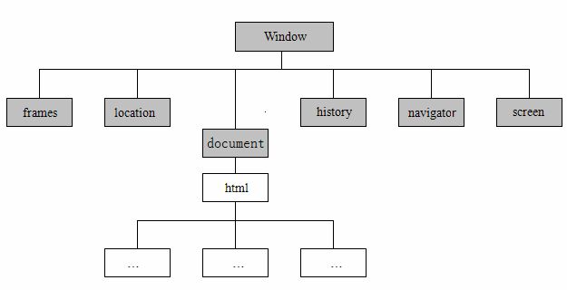

# BOM

> **BOM即是“Browser Object Model”，中文：浏览器对象模型**    

ECMAScript 是 JavaScript 的核心，但如果要在 Web 中使用 JavaScript，那么 BOM（浏览器对象模型）则无疑才是真正的核心。BOM 提供了很多对象，用于访问浏览器的功能，这些功能与任何网页内容无关。多年来，缺少事实上的规范导致 BOM 有很多问题，因为浏览器提供商会按照各自的想法随意去扩展它。W3C 为了把浏览器中 JavaScript 最基本的部分标准化，已经将 BOM 的主要方面纳入了 HTML5 的规范中。   

## ```window``` **对象**  
BOM 的核心对象是``` window```，它表示浏览器的一个实例。在浏览器中，```window``` 对象有双重角色，它既是通过 JavaScript 访问浏览器窗口的一个接口，又是 ECMAScript 规定的 ```Global``` 对象。这意味着在网页中定义的任何一个对象、变量和函数，都以 window 作为其 ```Global``` 对象，因此有权访问 ```isNaN()、isFinite()、parseInt()、parseFloat()``` 等方法。

>window 对象就是 BOM 的核心对象，所有的对象全部由 window 对象延伸出来，也可以说他们是 window 的子对象   

  

<center>

javascript顶级对象模型图
</center>


## 全局作用域

由于 ```window``` 对象同时扮演着 ECMAScript中 ```Global``` 对象的角色,因此所有在全局作用域中声明的变量、函数都会变成 ```window``` 对象的属性和方法。来看下面的例子。

```
var age=29;
function sayAge(){
    console.log(this.age);
}
console.log(age);
sayAge();
window.sayAge();
```

## window 的窗口大小问题
### 获取窗口宽高
有三种方式进行获取

1. 针对 IE9+ ， chrome ，Firefox，Opera 和safari

```
浏览器窗口的内部宽度
     window.innerWidth
 浏览器窗口的内部高埗
     window.innerHeight

 var msg = "窗口宽度" + window.innerWidth + 
 "\n窗口高度" + window.innerHeight;
 alert(msg);
```

2. 针对 IE6 / IE7 / IE8 / IE5，支持 Chrome 和 FireFox

```
浏览器内部高度
     document.documentElement.clientHeight
 浏览器内部宽度
     document.documentElement.clientWidth

 var msg = "窗口宽度" + document.documentElement.clientWidth + 
 "\n窗口高度" + document.documentElement.clientHeight;
 alert(msg);
```

3. 兼容的版本

```
 var w = window.innerWidth || document.documentElement.clientWidth;
 var h = window.innerHeight || document.documentElement.clientHeight;
 alert("窗口宽度：" + w + "\n窗口高度：" + h);
```

### 调整窗口大小

```
resizeTo()
    调整到指定大小
resizeBy()
    增加指定的宽度和高度（宽和高 增加10px）

一些浏览器已经将这个方法移除
但是，在 IE8 中还可以使用

封装的函数：
function to(){
    alert("small");
    window.resizeTo(200,200);
}
function by(){
    alert("增加 10px");
    window.resizeBy(10,10);//使窗口增加 10px
}
```

### 打开窗口

```
open(URL,name,features)
    该方法用于打开一个新的浏览器窗口 或者 查找一个已经命名的窗口

参数：
    URL ：可选参数
          主要声明了要在浏览器新窗口中显示文档的 URL 。
          如果省略该参数 或者 该参数数值为空，则新窗口不会显示任何文档。
    name：可选参数
          该参数是一个由多个逗号分隔的特征列表，其中包括数字，字母，下划线等等
          该参数主要用于声明新窗口的名称。
          这个名称还可以用作标记 <a> 和 <form> 的 target 属性。
          如果该参数指定一个已经存在的窗口，
          那么 open() 方法不再创建新窗口，而是返回该窗口的引用，同时忽略参数 features
    features：可选参数
          声明新窗口需要显示的标准浏览器的特征
          如果省略该参数，则新窗口具有所有浏览器的标准特征
          如果声明了特殊的特征，则按照声明执行

备注：如果不用到 Frame 框架，则只需要传入第一个参数和第二个参数即可


窗口的特征
width / height  窗口文档的宽度和高度
                单位为 像素
left / top      窗口的坐标
                单位是 像素
toolbar         是否显示浏览器的 工具栏
    yes / no    默认是 yes
    1 / 0
scrollbar       食肉显示 滚动条
    yes / no    默认是 yes
    1 / 0
location        是否显示 地址地段（地址栏）
    yes / no    默认是 yes
    1 / 0
status          是否添加 状态栏
    yes / no    默认是 yes
    1 / 0
fullscreen      是否使用全屏显示
    yes / no    默认是 no
    1 / 0
menubar         是否显示菜单栏
    yes / no    默认是 yes
    1 / 0
resizeable      是否可调节尺寸
    yes / no    默认是 yes
    1 / 0
titlebar        是否显示标题栏
    yes / no    默认是 yes
    1 / 0

<button onclick="openAnother()">打开新窗口</button>
<button onclick="closeOpenedWindow()">关闭新窗口</button>
<script type="text/javascript">
var win;
function openAnother(){
    //打开新窗口
    win = window.open("http://cn.bing.com/","","width = 400,height = 400,toolbar = 0, menubar = 0, left = 400, top = 200");
    //win.close();//导致新窗口打开后立即关闭
}
function closeOpenedWindow() {
    win.close();
}
</script>
```

## window中的定时器

```
window 对象中提供了两个类似于定时器的功能方法

   即： 超时调用和周期调用（间隙调用）

JS 中是单线程语言，但是它允许通过设置超时数值，以及间歇时间来调用代码在特定时间内执行

超时调用时在 指定的时间后去执行某段代码

周期调用时指 每隔指定的时间就去执行某段代码

超时调用
    window.setTimeout()
周期调用
    window.setInterval()
```

_这两个函数咱们都玩得很溜就不说了_

## 系统对话框

浏览器通过 alert()、confirm() 和 prompt() 方法可以调用系统对话框向用户显示消息。系统对话框与在浏览器中显示的网页没有关系，也不包含 HTML。它们的外观由操作系统及（或）浏览器设置决定，而不是由 CSS 决定。此外，通过这几个方法打开的对话框都是同步和模态的。也就是说，显示这些对话框的时候代码会停止执行，而关掉这些对话框后代码又会恢复执行。

第一种对话框是调用 alert() 方法生成的。它向用户显示一个系统对话框，其中包含指定的文本和一个 OK（“确定”）按钮。通常使用 alert() 生成的“警告”对话框向用户显示一些他们无法控制的消息，例如错误消息。而用户只能在看完消息后关闭对话框。

第二种对话框是调用 confirm() 方法生成的。从向用户显示消息的方面来看，这种“确认”对话框很像是一个“警告”对话框。但二者的主要区别在于“确认”对话框除了显示OK按钮外，还会显示一个 Cancel（“取消”）按钮，两个按钮可以让用户决定是否执行给定的操作。

为了确定用户是单击了OK还是Cancel，可以检查 confirm() 方法返回的布尔值：true 表示单击了OK，false 表示单击了Cancel或单击了右上角的 X 按钮。确认对话框的典型用法如下

```
if (confirm("Are you sure?")) {
    alert("I'm so glad you're sure! ");
} else {
    alert("I'm sorry to hear you're not sure.");
}
```

最后一种对话框是通过调用 prompt() 方法生成的，这是一个“提示”框，用于提示用户输入一些文本。提示框中除了显示 OK 和 Cancel 按钮之外，还会显示一个文本输入域，以供用户在其中输入内容。prompt() 方法接受两个参数：要显示给用户的文本提示和文本输入域的默认值（可以是一个空字符串）。

如果用户单击了 OK 按钮，则 promp() 返回文本输入域的值；如果用户单击了 Cancel 或没有单击 OK 而是通过其他方式关闭了对话框，则该方法返回 null。下面是一个例子。

```
var result = prompt("What is your name? ", "");
if (result !== null) {
    alert("Welcome, " + result);
}
```

**_系统自带的弹窗太丑了！！！我们后续课程会自定义模拟弹窗_**

## ```location```对象
```location``` 对象提供了与当前窗口中加载的文档有关的信息，还提供了一些导航功能。事实上，```location``` 对象是很特别的一个对象，因为它既是 ```window``` 对象的属性，也是 ```document``` 对象的属性；换句话说，```window.location``` 和 ```document.location``` 引用的是同一个对象。```location``` 对象的用处不只表现在它保存着当前文档的信息，还表现在它将 URL 解析为独立的片段，让开发人员可以通过不同的属性访问这些片段。下表列出了 ```location``` 对象的所有属性。

<table>
<thead>
<tr>
<th>属性名</th>
<th>例子</th>
<th>说明</th>
</tr>
</thead>
<tbody>
<tr>
<td>hash</td>
<td>"#contents"</td>
<td>返回 URL 中的 hash（#号后跟零或多个字符），如果 URL 中不包含散列，则返回空字符串</td>
</tr>
<tr>
<td>host</td>
<td>"shijiajie.com:80"</td>
<td>返回服务器名称和端口号（如果有）</td>
</tr>
<tr>
<td>hostname</td>
<td>"shijiajie.com"</td>
<td>返回不带端口号的服务器名称</td>
</tr>
<tr>
<td>href</td>
<td>"http:/shijiajie.com"</td>
<td>返回当前加载页面的完整URL。而 <code>location</code> 对象的 <code>toString()</code> 方法也返回这个值</td>
</tr>
<tr>
<td>pathname</td>
<td>"/WileyCDA/"</td>
<td>返回URL中的目录和（或）文件名</td>
</tr>
<tr>
<td>port</td>
<td>"8080"</td>
<td>返回 URL 中指定的端口号。如果 URL 中不包含端口号，则这个属性返回空字符串</td>
</tr>
<tr>
<td>protocol</td>
<td>"http:"</td>
<td>返回页面使用的协议。通常是 http: 或 https:</td>
</tr>
<tr>
<td>search</td>
<td>"?q=javascript"</td>
<td>返回URL的查询字符串。这个字符串以问号开头</td>
</tr></tbody></table>


### 查询字符串参数方法

```
/*
 * 这个函数用来解析来自URL的查询串中的name=value参数对
 * 它将name=value对存储在一个对象的属性中，并返回该对象
 * 这样来使用它
 *
 * var args = urlArgs(); // 从URL中解析参数
 * var q = args.q || ""; // 如果参数定义了的话就使用参数；否则使用一个默认值
 * var n = args.n ? parseInt(args.n) : 10;
 */
function urlArgs() {
    var args = {};                                  // 定义一个空对象
    var query = location.search.substring(1);       // 查找到查询串，并去掉'? '
    var pairs = query.split("&");                   // 根据"&"符号将查询字符串分隔开
    for (var i = 0; i < pairs.length; i++) {        // 对于每个片段
        var pos = pairs[i].indexOf('=');            // 查找"name=value"
        if (pos == -1) continue;                    // 如果没有找到的话，就跳过
        var name = pairs[i].substring(0, pos);      // 提取name
        var value = pairs[i].substring(pos + 1);    // 提取value
        value = decodeURIComponent(value);          // 对value进行解码
        args[name] = value;                         // 存储为属性
    }
    return args;                                    // 返回解析后的参数
}
```

### location 对象的常用方法

>location 对象的常用属性   
>assign(url) 加载新的文档   
```
location.assign("http://shijiajie.com");
```

>reload(reforce) 重新加载当前文档  
```
reload(reforce)
    该方法用于重新加载当前文档
    参数：
        reforce 可选参数
                一般填写 true
        该方法如果没有规定参数，或者填写参数为 false
        那么就会采用 HTTP 中的头 if-Modified-Since 来去检测
        服务器上文档是否已经发生改变

        如果文档已经发生改变，则会通过 reload() 方法重新
        加载该文档
        如果文档没有发生改变，则该方法从缓存中装载文件

        如果将该方法参数设为 true
        那么无论文档的最后修改日期是什么，
        都会绕过缓存，直接从服务器端重新下载该文档

如果该方法有参数，则会从服务器中重新下载
如果没有参数，则优先从缓存中重新加载

注意：
    reload() 方法调用之后可能会造成在 reload 加载顺序
    之后的文档不执行
    所以一般将 reload() 放在最后

示例：
function reload(){
    location.reload(true);
}
```
>replace(newURL) 用新的文档替换当前文档  
```
replace()
    用新的文档替换当前文档

    该方法不会在 history 对象中生存记录。

    使用该方法时，会直接采用熏得 URL 覆盖 History 对象中的当前记录

    按下后退，也不会返回刚才的网页

示例：
function replaceDoc(){
    //调用该方法时，当前窗口替换为必应
    location.replace("http://cn.bing.com");
}
```
## history对象（了解）
history 对象保存着用户上网的历史记录，从窗口被打开的那一刻算起。因为 history 是 window 对象的属性，因此每个浏览器窗口、每个标签页乃至每个框架，都有自己的 history 对象与特定的 window 对象关联。出于安全方面的考虑，开发人员无法得知用户浏览过的 URL。不过，借由用户访问过的页面列表，同样可以在不知道实际 URL 的情况下实现后退和前进。

```
History 对象
    history 对象包含用户（当前浏览器窗口）中访问过的 URL

    history 对象是 window 对象的一部分
    可以通过 window.history 进行访问

属性;
    length
        返回浏览器历史列表中的 URL 的数量
方法：
    back()
        加载 history 列表中的前一个 URL
    forward()
        加载 history 列表中的下一个 URL
    go()
        加载history 列表中的指定的某个页面
        如果为负数，则代表后退
        如果为正数，则代表前进


示例： 
function urlCount(){
    alert("历史列表中有 " + history.length + "个URL");
}
function myForward(){
    //前进
    history.forward();
}
function myBack(){
    //后退
    history.back();
}
function myGo(index){
    //指定跳转
    history.go(index);
}
```

## navigator对象（了解）

- navigator 对象包含有关浏览器的信息
- navigator 对象包含的属性描述正在使用的浏览器
- 我们可以根据这些属性，进行检测平台的配置

```
navigator 对象

属性:
    appCodeName     浏览器代码名的字符串表示
    appName         官方浏览器的字符串表示
    appVersion      浏览器版本信息的字符串
    systemLanguage  操作系统的语言
    language        浏览器的主语言
    onLine          是否连接互联网
    cookieEnable    是否启用了 Cookie
                    如果启用为 true
                    没有启用为 false
    platform        浏览器所在计算机平台的字符串
    plugins         安装在浏览器中插件的数组
    userAgent       用户代理头的字符串（返回当前浏览器的用户代理（user agent）字符串。）

用法：
    navigator.对应的属性

示例：
console.log("appCodeName" + navigator.appCodeName + "<br>");
console.log("appName" + navigator.appName + "<br>");
console.log("appVersion" + navigator.appVersion + "<br>");
console.log("systemLanguage" + navigator.systemLanguage + "<br>");
console.log("language" + navigator.language + "<br>");
console.log("onLine" + navigator.onLine + "<br>");
console.log("cookieEnable" + navigator.cookieEnable + "<br>");
console.log("platform" + navigator.platform + "<br>");
console.log("plugins" + navigator.plugins + "<br>");
console.log("userAgent" + navigator.userAgent + "<br>");
```

## screen对象（了解）
- screen 对象包含有关用户屏幕的信息
- 虽然 screen 对象 在 JS 中用处不大
- 但是 screen 对象 包含浏览器窗口外部的显示器的信息

例如能够获取到对应的 像素宽度和高度等

各个浏览器的 screen 对象 都办好不同的属性

但是每一个screen 对象 都至少包含一下信息

```
width       屏幕的像素宽度
height      屏幕的像素高度
colorDepth  屏幕用于显示颜色的位数
availWidth  屏幕的像素宽度减去系统部件后的值
            系统部件是指任务栏
availheight 屏幕的像素高度减去系统部件后的值
            系统部件是指任务栏

示例：
console.log("width : " + screen.width +"<br>");
console.log("height : " + screen.height +"<br>");
console.log("colorDepth : " + screen.colorDepth +"<br>");
console.log("availWidth: " + screen.availWidth +"<br>");
console.log("availHeight: " + screen.availHeight+"<br>");
```

## window中常用事件（掌握）
### onload---加载事件

```
onload---加载事件
当整个页面加载完成的时会触发该事件。
语法：
    window.onload = function(){} 或者 window.onload = 方法名

注意：一般把事件注册的代码放在head中

<script type="text/javascript">
    window.onload = function () {
        alert("页面加载完毕");
    }
</script>
```

### onscroll---滚动事件

```
onscroll---滚动事件
当窗口发生滚动会触发该事件

语法：
    window.onscroll = function(){} 或者 window.onscroll = 方法==名==

<script type="text/javascript">
    window.onscroll = function() {
        console.log("开始滚动...")
        //获取滚动距离。
        //document.body.scrollTop:火狐和ie不支持，
        //document.documentElement.scrollTop:chrome不支持
        //这样就可以跨浏览器了。
        console.log(document.documentElement.scrollTop || document.body.scrollTop);
    }
</script>
```

## cookie
### 什么是 cookie
- cookie的本质就是用键值对存储在用户本地的一些数据，这些数据不同的网站，不同的浏览器是不能共享的.
- Cookie，有时也用其复数形式 Cookies，指某些网站为了辨别用户身份、进行 session 跟踪而储存在用户本地终端上的数据（通常经过加密）。
- Cookie 是在 HTTP 协议下，服务器或脚本可以维护客户工作站上信息的一种方式。Cookie 是由 Web 服务器保存在用户浏览器（客户端）上的小文本文件，它可以包含有关用户的信息。无论何时用户链接到服务器，Web 站点都可以访问 Cookie 信息。
- cookie是浏览器提供的一种机制，它将document 对象的cookie属性提供给JavaScript。可以由JavaScript对其进行控制，而并不是JavaScript本身的性质。cookie是存于用户硬盘的一个文件，这个文件通常对应于一个域名，当浏览器再次访问这个域名时，便使这个cookie可用。因此，cookie可以跨越一个域名下的多个网页，但不能跨越多个域名使用。而且不同的浏览器之间cookie不能共享。

### cookie 的用处
1. 保存登录状态
2. 跟踪用户行为
3. 定制页面
4. 创建购物车

### cookie的缺陷
1. 会被禁用
2. 会被删除
3. 不同浏览器不能共用cookie
4. 安全系数低


### cookie 的构成
cookie 由浏览器保存的以下几块信息构成：

1. 名称：一个唯一确定 cookie 的名称。cookie 名称是不区分大小写的，所以 myCookie 和 MyCookie被认为是同一个 cookie。然而，实践中最好将 cookie 名称看作是区分大小写的，因为某些服务器会这样处理 cookie。cookie 的名称必须是经过 URL 编码的。
2. 值：储存在 cookie 中的字符串值。值必须被 URL 编码。
3. 域：cookie 对于哪个域是有效的。所有向该域发送的请求中都会包含这个 cookie 信息。这个值可以包含子域（subdomain，如 www.wrox.com (applewebdata://5BEC3925-17C6-4483-85F7-9ED7F4BB2EBC/www.wrox.com) ），也可以不包含它（如 wrox.com ，则对于wrox.com的所有子域都有效）。如果没有明确设定，那么这个域会被认作来自设置 cookie 的那个域。
4. 路径：对于指定域中的那个路径，应该向服务器发送 cookie。例如，你可以指定 cookie 只有从 http://www.wrox.com/books/ 中才能访问，那么 http://www.wrox.com (http://www.wrox.com/) 的页面就不会发送 cookie 信息，即使请求都是来自同一个域的。
5. 失效时间：表示 cookie 何时应该被删除的时间戳（也就是，何时应该停止向服务器发送这个cookie）。默认情况下，浏览器会话结束时即将所有 cookie 删除；不过也可以自己设置删除时间。这个值是个 GMT 格式的日期（Wdy, DD-Mon-YYYY HH:MM:SS GMT），用于指定应该删除cookie 的准确时间。因此，cookie 可在浏览器关闭后依然保存在用户的机器上。如果你设置的失效日期是个以前的时间，则 cookie 会被立刻删除。
6. 安全标志：指定后，cookie 只有在使用 SSL 连接的时候才发送到服务器。例如，cookie 信息只能发送给 https://www.wrox.com (https://www.wrox.com/) ，而 http://www.wrox.com (http://www.wrox.com/) 的请求则不能发送 cookie。

### 存储 cookie

有2种途径去存储cookie：

1. 服务器端通过http响应头Set-Cookie来通知浏览器存储cookie (**只需了解**)

```
 HTTP/1.1 200 OK
 Content-type: text/html
 Set-Cookie: name=value; expires=Mon, 22-Jan-07 07:10:24 GMT; domain=.wrox.com
 Other-header: other-header-value
 ```


 2. 客户端(浏览器端)通过JavaScript去存储cookie(重点研究)。Javascript操作cookie需要通过document的cookie属性来完成。

 ```
 存储 cookie 的时候，有两个值是必需给出的
name 和 value

参数1：cookie 的 name
参数2：cookie 的 value
参数3：cookie 的存储时间（单位 day）

cookie 中 name 不同，就可以存储多个 cookie

//==================================================

//存储cookie，并设置超时时间。  domaim和secure使用默认的情况
function saveCookie(name, value, expiredays){
    var date = new Date();
    alert(date.getDate());
    date.setDate(date.getDate() + expiredays);
    alert(date.toGMTString());
    //cookie的内容其实就是一串纯文本。 对字符最好进行url编码，否则如果有中文就回出现问题。
    var cookieText = encodeURIComponent(name) + "=" + 
                    encodeURIComponent(value) + "; expires=" + date.toGMTString();
    document.cookie = cookieText;
}

saveCookie("name", "张三", 1);

//读取cookie
//读取cookie仍然是通过document的cookie属性，不过字符串需要我们自己解析。
function getCookie (name) {
    //先拿到cookie字符串
    var cookieText = document.cookie;
    //获取要查找的 cookie的 name所在的下标
    var index = cookieText.indexOf(name + "=");  // name=李四; ...
    //如果下标不为-1，证明找到了
    if(index != -1){
        var endIndex = cookieText.indexOf(";", index);    //查找指定的cookie的结束为止
        // 如果等于-1，证明没有找到;号，则把末尾设置为字符串的末尾
        endIndex = (endIndex == -1 ? cookieText.length : endIndex);
        //把想要的cookie的value截取出来
        var value = cookieText.substring(index + (name + "=").length, endIndex);
        //因为存储的时候使用了url编码，所以查到的东西需要url解码
        return decodeURIComponent(value);
    }
}
var value = getCookie("name");
if(value){
    alert("欢迎你：" + value);
}

//删除 cookie
//删除cookie的原理非常简单，只要把超时时间设置为0，就回立即删除了
function saveCookie(name, value, expiredays){

    var date = new Date();
    alert(date.getDate())
    date.setDate(date.getDate() + expiredays);
    alert(date.toGMTString())
    //cookie的内容其实就是一串纯文本。 对字符最好进行url编码，否则如果有中间就会出现问题。
    var cookieText = encodeURIComponent(name) + "=" + encodeURIComponent(value) + "; expires=" + date.toGMTString();
    document.cookie = cookieText;
}
saveCookie("name", "", 0);
 ```


