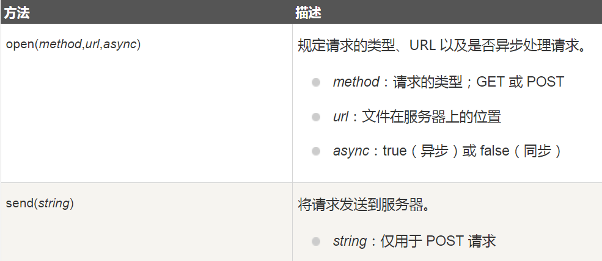
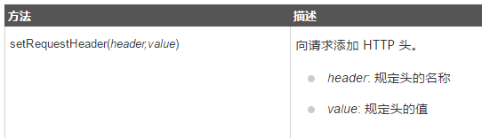
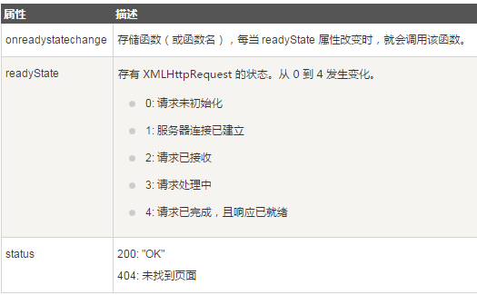

# 1. AJAX
<!-- TOC -->

- [1. AJAX](#1-ajax)
    - [1.1. Ajax简介](#11-ajax简介)
    - [1.2. Ajax工作原理](#12-ajax工作原理)
    - [1.3. Ajax优缺点](#13-ajax优缺点)
        - [1.3.1. Ajax的优点](#131-ajax的优点)
        - [1.3.2. Ajax缺点](#132-ajax缺点)
    - [1.4. AJAX - 创建 XMLHttpRequest 对象](#14-ajax---创建-xmlhttprequest-对象)
    - [1.5. AJAX - 向服务器发送请求请求](#15-ajax---向服务器发送请求请求)
        - [1.5.1. 向服务器发送请求](#151-向服务器发送请求)
        - [1.5.2. GET 还是 POST？](#152-get-还是-post)
            - [1.5.2.1. GET 请求](#1521-get-请求)
            - [1.5.2.2. POST 请求](#1522-post-请求)
        - [1.5.3. url - 服务器上的文件](#153-url---服务器上的文件)
        - [1.5.4. 异步 - True 或 False？](#154-异步---true-或-false)
    - [1.6. AJAX - onreadystatechange 事件](#16-ajax---onreadystatechange-事件)
        - [1.6.1. onreadystatechange 事件](#161-onreadystatechange-事件)
    - [1.7. AJAX - 服务器 响应](#17-ajax---服务器-响应)
        - [1.7.1. 服务器响应](#171-服务器响应)
        - [1.7.2. responseText 属性](#172-responsetext-属性)
        - [1.7.3. responseXML 属性(了解即可)](#173-responsexml-属性了解即可)
    - [1.8. 完整代码](#18-完整代码)
    - [1.9. task1:封装函数](#19-task1封装函数)
    - [1.10. task2:封装对象](#110-task2封装对象)
    - [1.11. task3:应用ajax模拟登陆](#111-task3应用ajax模拟登陆)
    - [1.12. task4:获取公共结构，比如  header footer](#112-task4获取公共结构比如--header-footer)
    - [1.13. task5:瀑布流应用](#113-task5瀑布流应用)

<!-- /TOC -->
## 1.1. Ajax简介

在上世纪90年代，几乎所有的网站都由HTML页面实现，服务器处理每一个用户请求都需要重新加载网页。形式是怎样的呢？就比如说你在浏览器上登录自己的微博账号，填完了表单，点击登录按钮，一次"完整"的HTTP请求就此触发，服务器发现你的登录密码不对头，立马把网页原原本本的返回给你，在用户看来呢，就是一次重新加载的过程！用户体验极差！而且这个做法浪费了许多带宽，因为在前后两个页面中的大部分HTML码往往是相同的。由于每次应用的沟通都需要向服务器发送请求，应用的回应时间依赖于服务器的回应时间。这导致了用户界面的回应比本机应用慢得多。

到了2005年，google率先在它的应用(诸如google地图、gmail)里使用了ajax技术，这才让这项技术正式风靡开来。

如今它的应用已经十分广泛：

- 运用XHTML+CSS来表达信息；
- 运用JavaScript操作DOM（Document Object Model）来运行动态效果；
- 运用XML和XSLT操作数据；
- 运用XMLHttpRequest或新的Fetch API与网页服务器进行异步数据交换；
- 注意：AJAX与Flash、Silverlight和Java Applet等RIA技术是有区分的。

## 1.2. Ajax工作原理

Ajax的工作原理相当于在用户和服务器之间加了一个中间层(ajax引擎),使用户操作与服务器响应异步化。并不是所有的用户请求都提交给服务器,像—些数据验证(比如判断用户是否输入了数据)和数据处理(比如判断用户输入数据是否是数字)等都交给Ajax引擎自己来做, 只有确定需要从服务器读取新数据时再由Ajax引擎代为向服务器提交请求。把这些交给了Ajax引擎，用户操作起来也就感觉更加流畅了。

## 1.3. Ajax优缺点

### 1.3.1. Ajax的优点

1. 无刷新更新数据。 

>AJAX最大优点就是能在不刷新整个页面的前提下与服务器通信维护数据。这使得Web应用程序更为迅捷地响应用户交互，并避免了在网络上发送那些没有改变的信息，减少用户等待时间，带来非常好的用户体验。

2. 异步与服务器通信。

>AJAX使用异步方式与服务器通信，不需要打断用户的操作，具有更加迅速的响应能力。优化了Browser和Server之间的沟通，减少不必要的数据传输、时间及降低网络上数据流量。

3. 前端和后端负载平衡。

>AJAX可以把以前一些服务器负担的工作转嫁到客户端，利用客户端闲置的能力来处理，减轻服务器和带宽的负担，节约空间和宽带租用成本。并且减轻服务器的负担，AJAX的原则是“按需取数据”，可以最大程度的减少冗余请求和响应对服务器造成的负担，提升站点性能。

4. 基于标准被广泛支持。

>AJAX基于标准化的并被广泛支持的技术，不需要下载浏览器插件或者小程序，但需要客户允许JavaScript在浏览器上执行。随着Ajax的成熟，一些简化Ajax使用方法的程序库也相继问世。同样，也出现了另一种辅助程序设计的技术，为那些不支持JavaScript的用户提供替代功能。

5. 界面与应用分离。

>Ajax使WEB中的界面与应用分离（也可以说是数据与呈现分离），有利于分工合作、减少非技术人员对页面的修改造成的WEB应用程序错误、提高效率、也更加适用于现在的发布系统。

### 1.3.2. Ajax缺点

1. AjAX干掉了Back和加入收藏书签功能，即对浏览器机制的破坏。

>对应用Ajax最主要的批评就是，它可能破坏浏览器的后退与加入收藏书签功能。在动态更新页面的情况下，用户无法回到前一个页面状态，这是因为浏览器仅能记下历史记录中的静态页面。一个被完整读入的页面与一个已经被动态修改过的页面之间的可能差别非常微妙；用户通常都希望单击后退按钮，就能够取消他们的前一次操作，但是在Ajax应用程序中，却无法这样做。

2. AJAX的安全问题。

>AJAX技术给用户带来很好的用户体验的同时也对IT企业带来了新的安全威胁，Ajax技术就如同对企业数据建立了一个直接通道。这使得开发者在不经意间会暴露比以前更多的数据和服务器逻辑。Ajax的逻辑可以对客户端的安全扫描技术隐藏起来，允许黑客从远端服务器上建立新的攻击。还有Ajax也难以避免一些已知的安全弱点，诸如跨站点脚步攻击、SQL注入攻击和基于Credentials的安全漏洞等等。


3. 因为网络延迟需要给用户提供必要提示

>进行Ajax开发时，网络延迟——即用户发出请求到服务器发出响应之间的间隔——需要慎重考虑。如果不给予用户明确的回应，没有恰当的预读数据，或者对XMLHttpRequest的不恰当处理，都会使用户感到厌烦。通常的解决方案是，使用一个可视化的组件来告诉用户系统正在进行后台操作并且正在读取数据和内容。


## 1.4. AJAX - 创建 XMLHttpRequest 对象


    Ajax(Asynchronous JavaScript and XML)不是指一种单一的技术，而是有机地利用了一系列相关的技术。虽然其名称包含XML，但实际上数据格式可以由JSON代替，进一步减少数据量，形成所谓的Ajax。为了使用JavaScript向服务器发出 HTTP 请求，需要一个提供此功能的类的实例。这就是XMLHttpRequest的由来。这样的类最初是在Internet Explorer中作为一个名为XMLHTTP的ActiveX对象引入的。然后，Mozilla，Safari和其他浏览器，实现一个XMLHttpRequest类，支持Microsoft的原始ActiveX对象的方法和属性。同时微软也实现了XMLHttpRequest。

    显而易见XMLHttpRequest类是重中之重了。

XMLHttpRequest 是 AJAX 的基础。

所有现代浏览器（IE7+、Firefox、Chrome、Safari 以及 Opera）均内建 XMLHttpRequest 对象。  
创建 XMLHttpRequest 对象的语法：

    var iable=new XMLHttpRequest();


老版本的 Internet Explorer （IE5 和 IE6）使用 ActiveX 对象：

    var iable=new ActiveXObject("Microsoft.XMLHTTP");

为了应对所有的现代浏览器，包括 IE5 和 IE6，请检查浏览器是否支持 XMLHttpRequest 对象。如果支持，则创建 XMLHttpRequest 对象。如果不支持，则创建 ActiveXObject ：

    var xhr;
    if (window.XMLHttpRequest){ 
        // IE7+, Firefox, Chrome, Opera, Safari 浏览器执行代码 
        xhr=new XMLHttpRequest();
    }else{ 
        // IE6, IE5 浏览器执行代码 
        xhr=new ActiveXObject("Microsoft.XMLHTTP");
    }

很明显，这个代码太冗长了，使用三目运算符简化代码

    var xhr=window.XMLHttpRequest?new XMLHttpRequest():new ActiveXObject("Microsoft.XMLHTTP");

## 1.5. AJAX - 向服务器发送请求请求

### 1.5.1. 向服务器发送请求

如需将请求发送到服务器，我们使用 XMLHttpRequest 对象的 open() 和 send() 方法：

    xhr.open("GET","demo.txt",true);
    xhr.send();



### 1.5.2. GET 还是 POST？

与 POST 相比，GET 更简单也更快，并且在大部分情况下都能用。
然而，在以下情况中，请使用 POST 请求：

- 无法使用缓存文件（更新服务器上的文件或数据库）
- 向服务器发送大量数据（POST 没有数据量限制）
- 发送包含未知字符的用户输入时，POST 比 GET 更稳定也更可靠


#### 1.5.2.1. GET 请求

一个简单的 GET 请求:

    xhr.open("GET","/api/getNewsList",true);
    xhr.send();

在上面的例子中，您可能得到的是缓存的结果。   
为了避免这种情况，请向 URL 添加一个唯一的 ID：  

    xhr.open("GET","/api/getNewsList?t=" + Math.random(),true);
    xhr.send();

如果您希望通过 GET 方法发送信息，请向 URL 添加信息：

    xhr.open("GET","/api/getNewsList?fname=Henry&lname=Ford",true);
    xhr.send();

#### 1.5.2.2. POST 请求

一个简单 POST 请求：

    xhr.open("POST","/api/postNewsList",true);
    xhr.send();

如果需要像 HTML 表单那样 POST 数据，请使用 setRequestHeader() 来添加 HTTP 头。   
然后在 send() 方法中规定您希望发送的数据：

    xhr.open("POST","/api/postNewsList",true);
    xhr.setRequestHeader("Content-type","application/x-www-form-urlencoded");
    xhr.send("fname=Henry&lname=Ford");



### 1.5.3. url - 服务器上的文件 

open() 方法的 url 参数是服务器上文件的地址：

    xhr.open("GET","header.html",true);

该文件可以是任何类型的文件，比如 .txt 和 .xml，或者服务器脚本文件，比如 .asp 和 .php （在传回响应之前，能够在服务器上执行任务）。


### 1.5.4. 异步 - True 或 False？

AJAX 指的是异步 JavaScript 和 XML（Asynchronous JavaScript and XML）。
XMLHttpRequest 对象如果要用于 AJAX 的话，其 open() 方法的 async 参数必须设置为 true：

    xhr.open("GET","header.html",true);

## 1.6. AJAX - onreadystatechange 事件

### 1.6.1. onreadystatechange 事件

当请求被发送到服务器时，我们需要执行一些基于响应的任务。
每当 readyState 改变时，就会触发 onreadystatechange 事件。
readyState 属性存有 XMLHttpRequest 的状态信息。
下面是 XMLHttpRequest 对象的三个重要的属性：




在 onreadystatechange 事件中，我们规定当服务器响应已做好被处理的准备时所执行的任务。   
当 readyState 等于 4 且状态为 200 时，表示响应已就绪：

    xhr.onreadystatechange=function()  {  
        if (xhr.readyState==4 && xhr.status==200)    {    
           // do something
        }  
    }

>注意： onreadystatechange 事件被触发 5 次（0 - 4），对应着 readyState 的每个变化。


## 1.7. AJAX - 服务器 响应

### 1.7.1. 服务器响应

如需获得来自服务器的响应，请使用 XMLHttpRequest 对象的 responseText 或 responseXML 属性。


属性	|描述
-|-
responseText|	获得字符串形式的响应数据。
responseXML|	获得 XML 形式的响应数据。

### 1.7.2. responseText 属性

如果来自服务器的响应并非 XML，请使用 responseText 属性。 

responseText 属性返回字符串形式的响应，因此您可以这样使用： 

    xhr.onreadystatechange=function()  {  
        if (xhr.readyState==4 && xhr.status==200)    {    
           document.getElementById("myDiv").innerHTML=xhr.responseText;
        }  
    }


### 1.7.3. responseXML 属性(了解即可)

如果来自服务器的响应是 XML，而且需要作为 XML 对象进行解析，请使用 responseXML 属性：  


    xhr.onreadystatechange=function()  {  
        if (xhr.readyState==4 && xhr.status==200) {    
            xmlDoc=xhr.responseXML;
            txt="";
            x=xmlDoc.getElementsByTagName("ARTIST");
            for (i=0;i<x.length;i++){ 
                txt=txt + x[i].childNodes[0].nodeValue + "<br>";
            }
            document.getElementById("myDiv").innerHTML=txt;
        }  
    }


## 1.8. 完整代码

```
    <script>
        var xhr=window.XMLHttpRequest?new XMLHttpRequest():new ActiveXObject("Microsoft.XMLHTTP");
        xhr.onreadystatechange=function()  {  
            if (xhr.readyState==4 && xhr.status==200)    {    
                document.getElementById("myDiv").innerHTML=xhr.responseText;
            } 
        }
        xhr.open('GET','header.html',true);
        xhr.send();
    </script>
```

## 1.9. task1:封装函数 

## 1.10. task2:封装对象

## 1.11. task3:应用ajax模拟登陆

## 1.12. task4:获取公共结构，比如  header footer

## 1.13. task5:瀑布流应用
   

