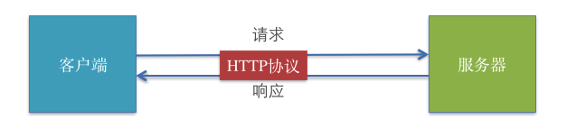
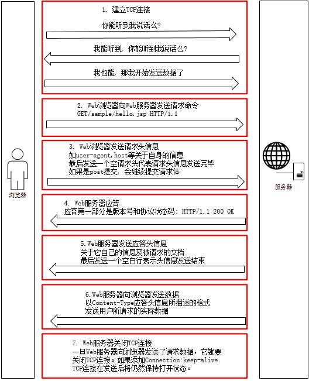
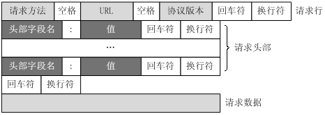
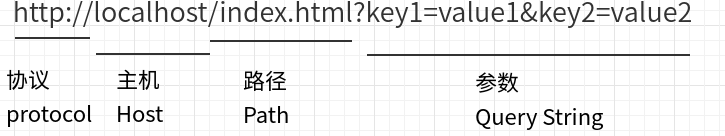
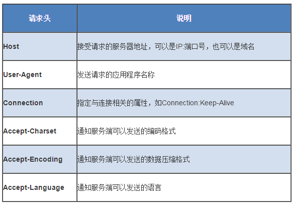
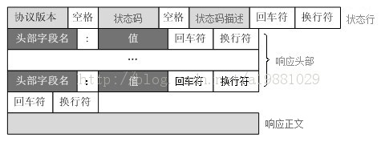
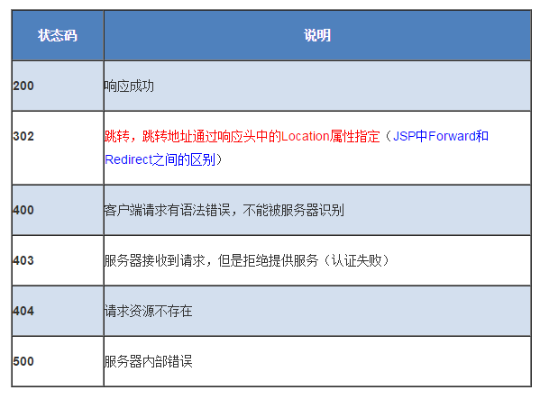
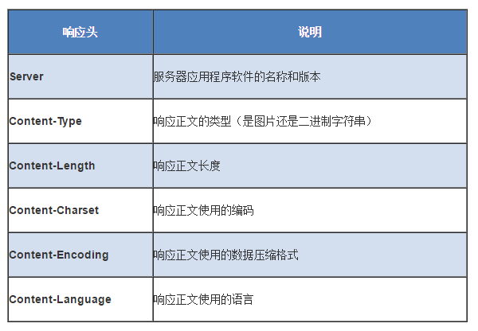

<h1 align="center">HTTP</h1>

## 0.1. HTTP协议
本质上是一种协议，全称是Hypertext Transfer Protocol，即超文本传输协议。从名字上可以看出该协议用于规定客户端与服务端之间的传输规则，所传输的内容不局限于文本(其实可以传输任意类型的数据)。

> 学习web前端也要了解HTTP协议及Server端技术服务器端脚本编程(后台开发)也是Web开发人员的基本功之一

<!-- TOC -->

- [0.1. HTTP协议](#01-http协议)
- [0.2. HTTP请求和响应步骤](#02-http请求和响应步骤)
- [0.3. http每一步详细内容](#03-http每一步详细内容)
    - [0.3.1. 建立TCP连接](#031-建立tcp连接)
    - [0.3.2. Web浏览器向Web服务器发送请求命令](#032-web浏览器向web服务器发送请求命令)
    - [0.3.3. Web浏览器发送请求头信息](#033-web浏览器发送请求头信息)
    - [0.3.4. Web服务器应答](#034-web服务器应答)
    - [0.3.5. Web服务器发送应答头信息](#035-web服务器发送应答头信息)
    - [0.3.6. Web服务器向浏览器发送数据](#036-web服务器向浏览器发送数据)
    - [0.3.7. Web服务器关闭TCP连接](#037-web服务器关闭tcp连接)
- [0.4. 请求方法](#04-请求方法)
    - [0.4.1. GET](#041-get)
    - [0.4.2. POST](#042-post)
    - [0.4.3. HEAD](#043-head)
- [0.5. HTTP请求报文(Requset Headers)](#05-http请求报文requset-headers)
    - [0.5.1. 请求行](#051-请求行)
    - [0.5.2. 请求方法](#052-请求方法)
    - [0.5.3. 请求地址](#053-请求地址)
    - [0.5.4. 请求头](#054-请求头)
    - [0.5.5. 请求数据](#055-请求数据)
- [0.6. HTTP响应报文（Response Headers）](#06-http响应报文response-headers)
    - [0.6.1. 状态行](#061-状态行)
        - [0.6.1.1. 状态码](#0611-状态码)
    - [0.6.2. 响应头部](#062-响应头部)
    - [0.6.3. 响应数据](#063-响应数据)

<!-- /TOC -->

## 0.2. HTTP请求和响应步骤

## 0.3. http每一步详细内容

### 0.3.1. 建立TCP连接

在HTTP工作开始之前, Web浏览器首先要通过网络与Web服务器建立连接, 该连接是通过TCP来完成的, 该协议与IP协议共同构建Internet, 即著名的TCP/IP协议族, 因此Internet又被称作是TCP/IP网络.

HTTP是比TCP更高层次的应用层协议, 根据规则, 只有低层协议建立之后才能进行更高层协议的连接, 因此, 首先要建立TCP连接, 一般TCP连接的端口号是80.

TCP连接中我们比较熟悉的就是三次握手, 但是为什么是三次而不是两次或四次呢? 这里我想到了一个比喻来让大家明白.

	敌人封锁江面, 我方间谍和联络员只能通过电报机隔着江面交流. 但是那时的电报机质量不稳定, 有可能会出现失灵的情况. 所以就出现了如下对话:
	
	间谍: 联络员, 你能收到我发的话么? 你要是能收到, 就说明我这个电报机可以发电报.
	联络员: 间谍, 我收到你发的话了, 这说明我的电报机可以收. 但是我不确定我的电报机能不能发, 你能收到我发的这句话么? 你要是能收到, 就说明我的电报机是可以发电报的. 
	间谍: 联络员, 我收到你的话了. 我的电报机也是能发能收, 我们可以正式交流情报了.

希望通过这个故事让大家明白为什么会有tcp三次握手

### 0.3.2. Web浏览器向Web服务器发送请求命令

一旦建立了TCP连接, Web浏览器就会向Web服务器发送请求命令

例如：GET/sample/hello.jsp HTTP/1.1

### 0.3.3. Web浏览器发送请求头信息

浏览器发送其请求命令之后, 还要以头信息的形式向Web服务器发送一些别的信息, 这些信息用来描述浏览器自己. 之后浏览器发送了一空白行来通知服务器, 表示它已经结束了该头信息的发送. 若是post请求, 还会在发送完请求头信息之后发送请求体.

### 0.3.4. Web服务器应答

客户机向服务器发出请求后, 服务器会向客户机回送应答.   
HTTP/1.1 200 OK   
应答的第一部分是协议的版本号和应答状态码

### 0.3.5. Web服务器发送应答头信息

正如客户端会随同请求发送关于自身的信息一样,服务器也会随同应答向用户发送关于它自己的数据及被请求的文档. 最后以一个空白行来表示头信息发送到此结束.

### 0.3.6. Web服务器向浏览器发送数据

Web服务器向浏览器发送头信息后, 它就以Content-Type应答头信息所描述的格式发送用户所请求的实际数据

### 0.3.7. Web服务器关闭TCP连接

一般情况下, 一旦Web服务器向浏览器发送了请求数据, 它就要关闭TCP连接. 如果浏览器或者服务器在其头信息加入了这行代码   
	Connection:keep-alive   
TCP连接在发送后将仍然保持打开状态. 于是, 浏览器可以继续通过相同的连接发送请求. 保持连接节省了为每个请求建立新连接所需的时间, 还节约了网络带宽.  

## 0.4. 请求方法

>在 HTTP 协议中，HTTP 请求可以使用多种请求方法，这些方法指明了要以何种方式来访问 Request-URI 所标识的资源。HTTP1.1 支持的请求方法如下表所示：

方法 |作用
-|-
GET| 请求获取由 Request-URI 所标识的资源
POST|    请求服务器接收在请求中封装的实体，并将其作为由 Request-Line 中的 Request-URI 所标识的资源的一部分
HEAD|    请求获取由 Request-URI 所标识的资源的响应消息报头
PUT |请求服务器存储一个资源，并用 Request-URI 作为其标识符
DELETE|  请求服务器删除由 Request-URI 所标识的资源
TRACE |  请求服务器回送到的请求信息，主要用于测试或诊断
CONNECT| 保留将来使用
OPTIONS |请求查询服务器的性能，或者查询与资源相关的选项和需求

**重点介绍 GET、POST 和 HEAD 三个方法：**

### 0.4.1. GET

GET 方法用于获取由 Request-URI 所标识的资源的信息，常见的形式是：

	GET Request-URI HTTP/1.1

GET方法是默认的HTTP请求方法，例如当我们通过在浏览器的地址栏中直接输入网址的方式去访问网页的时候，浏览器采用的就是 GET 方法向服务器获取资源。

我们可以使用GET方法来提交表单数据，用GET方法提交的表单数据只经过了简单的编码，同时它将作为URL的一部分向服务器发送，因此，如果使用GET方法来提交表单数据就存在着安全隐患上。例如：

	<Http://localhost/login.php?username=aa&password=1234>

从上面的URL请求中，很容易就可以辩认出表单提交的内容。（？之后的内容）另外由于GET方法提交的数据是作为URL请求的一部分所以提交的数据量不能太大。这是因为浏览器对url的长度有限制

各种浏览器也会对url的长度有所限制，下面是几种常见浏览器的url长度限制:(单位:字符)

	IE : 2803
	Firefox:65536
	Chrome:8182
	Safari:80000
	Opera:190000 

### 0.4.2. POST

POST方法是GET方法的一个替代方法，它主要是向Web服务器提交表单数据，尤其是大批量的数据。 在请求头信息结束之后的两个回车换行之后（实际是空一行），就是表单提交的数据。如上面提到的post表单数据：

	username=aa&password=1234

POST方法克服了GET方法的一些缺点。通过POST方法提交表单数据时，数据不是作为URL请求的一部分而是作为标准数据传送给Web服务器，这就克服了GET方法中的信息无法保密和数据量太小的缺点。因此，出于安全的考虑以及对用户隐私的尊重，通常表单提交时采用POST方法。

从编程的角度来讲，如果用户通过GET方法提交数据，则数据存放在QUERY＿STRING环境变量中，而POST方法提交的数据则可以从标准输入流中获取。

GET与POST方法有以下区别：

	1、  在客户端，Get方式在通过URL提交数据，数据在URL中可以看到；POST方式，数据放在HTTP包的body中。

	2、 GET方式提交的数据大小有限制（因为浏览器对URL的长度有限制），而POST则没有此限制。

	3、安全性问题。正如在GET中提到，使用 Get 的时候，参数会显示在地址栏上，而 Post 不会。所以，如果这些数据是中文数据而且是非敏感数据，那么使用 get；如果用户输入的数据不是中文字符而且包含敏感数据，那么还是使用 post为好。

	4.、服务器取值方式不一样。GET方式取值，如php可以使用$_GET来取得变量的值，而POST方式通过$_POST来获取变量的值。

### 0.4.3. HEAD

HEAD 方法与 GET 方法几乎是相同的，它们的区别在于 HEAD 方法只是请求消息报头，而不是完整的内容。对于 HEAD 请求的回应部分来说，它的 HTTP 头部中包含的信息与通过 GET 请求所得到的信息是相同的。利用这个方法，不必传输整个资源内容，就可以得到 Request-URI 所标识的资源的信息。这个方法通常被用于测试超链接的有效性，是否可以访问，以及最近是否更新。

要注意的是，在 HTML 文档中，书写 get 和 post，大小写都可以，但在 HTTP 协议中的 GET 和 POST 只能是大写形式。

## 0.5. HTTP请求报文(Requset Headers)

一个HTTP请求报文由请求行（request line）、请求头部（header）、空行和请求数据4个部分组成，下图给出了请求报文的一般格式。

### 0.5.1. 请求行

请求行分为三个部分：请求方法、请求地址和协议版本

### 0.5.2. 请求方法 

[点我查看上个分类](#04-请求方法)

	HTTP/1.1 定义的请求方法有8种：GET、POST、PUT、DELETE、PATCH、HEAD、OPTIONS、TRACE。

	最常的两种GET和POST，如果是RESTful接口的话一般会用到GET、POST、DELETE、PUT。

### 0.5.3. 请求地址

	URL:统一资源定位符，是一种自愿位置的抽象唯一识别方法。

	组成：<协议>：//<主机>：<端口>/<路径>

	端口和路径有时可以省略（HTTP默认端口号是80）

如下例：

### 0.5.4. 请求头

请求头部为请求报文添加了一些附加信息，由“名/值”对组成，每行一对，名和值之间使用冒号分隔。

常见请求头如下：

请求头部的最后会有一个空行，表示请求头部结束，接下来为请求数据，这一行非常重要，必不可少。

### 0.5.5. 请求数据

可选部分，比如GET请求就没有请求数据。

下面是一个POST方法的请求报文：

	POST 　/index.php　HTTP/1.1 　　 请求行
	Host: localhost
	User-Agent: Mozilla/5.0 (Windows NT 5.1; rv:10.0.2) Gecko/20100101 Firefox/10.0.2　　请求头
	Accept: text/html,application/xhtml+xml,application/xml;q=0.9,/;q=0.8
	Accept-Language: zh-cn,zh;q=0.5
	Accept-Encoding: gzip, deflate
	Connection: keep-alive
	Referer: http://localhost/
	Content-Length：25
	Content-Type：application/x-www-form-urlencoded
	　　空行
	username=aa&password=1234　　请求数据

## 0.6. HTTP响应报文（Response Headers）

HTTP响应报文主要由状态行、响应头部、空行以及响应数据组成。

### 0.6.1. 状态行

由3部分组成，分别为：协议版本，状态码，状态码描述。

其中协议版本与请求报文一致，状态码描述是对状态码的简单描述，所以这里就只介绍状态码。

#### 0.6.1.1. 状态码

	状态代码为3位数字。
	1xx：指示信息--表示请求已接收，继续处理。
	2xx：成功--表示请求已被成功接收、理解、接受。
	3xx：重定向--要完成请求必须进行更进一步的操作。
	4xx：客户端错误--请求有语法错误或请求无法实现。
	5xx：服务器端错误--服务器未能实现合法的请求。

下面列举几个常见的：

### 0.6.2. 响应头部

与请求头部类似，为响应报文添加了一些附加信息

常见响应头部如下：

### 0.6.3. 响应数据

用于存放需要返回给客户端的数据信息。

下面是一个响应报文的实例：

	HTTP/1.1 200 OK　　状态行
	Date: Sun, 17 Mar 2013 08:12:54 GMT　　响应头部
	Server: Apache/2.2.8 (Win32) PHP/5.2.5
	X-Powered-By: PHP/5.2.5
	Set-Cookie: PHPSESSID=c0huq7pdkmm5gg6osoe3mgjmm3; path=/
	Expires: Thu, 19 Nov 1981 08:52:00 GMT
	Cache-Control: no-store, no-cache, must-revalidate, post-check=0, pre-check=0
	Pragma: no-cache
	Content-Length: 4393
	Keep-Alive: timeout=5, max=100
	Connection: Keep-Alive
	Content-Type: text/html; charset=utf-8
	　　空行

	<html>　　响应数据
	<head>
	<title>HTTP响应示例<title>
	</head>
	<body>
	Hello HTTP!
	</body>
	</html>

