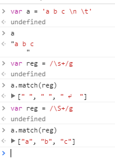
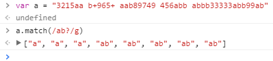
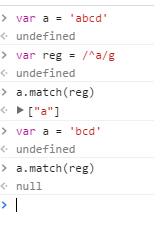

# 1. 正则表达式

有些代码是这样的：`/^\s*|\s*$/`，然后还有这样的：`/^.&/`。   
What the this？  
这是什么鬼，难道是代码表情包吗？

> 课程目标
1. 掌握如何创建正则表达式
2. 熟悉正则表达式语法
3. 掌握常用正则表达式

<!-- TOC -->

- [1. 正则表达式](#1-正则表达式)
    - [1.1. 什么是正则表达式？怎样创建正则表达式？](#11-什么是正则表达式怎样创建正则表达式)
    - [1.2. 匹配模式](#12-匹配模式)
    - [1.3. 范围匹配以及条件匹配](#13-范围匹配以及条件匹配)
    - [1.4. 匹配某类型的字符](#14-匹配某类型的字符)
    - [1.5. 匹配字符的数量规则](#15-匹配字符的数量规则)
    - [1.6. 匹配开头和结尾的字符](#16-匹配开头和结尾的字符)
    - [1.7. 正则表达式内置方法](#17-正则表达式内置方法)
    - [1.8. 字符串操作与正则表达式](#18-字符串操作与正则表达式)

<!-- /TOC -->

**_课件里面有个图形化学习工具，主要是用来给大家更高更容易的学习正则_**

[你懂得](http://www.jianshu.com/p/ed3588b83e7d)

## 1.1. 什么是正则表达式？怎样创建正则表达式？

- 正则表达式是什么？

正则表达式是一种模式，用以描述某种类型的内容，通常用来筛选字符串，它的缩写是RegExp

- 创建正则表达式的方法

**构造正则表达式** 

可以使用关键词`new`和`RegExp`构造一个正则表达式，这种方法可以传入一个字符串用作正则表达式的匹配：   

**使用字面量创建正则表达式**

和用字面量创建数组的方式相同，正则表达式可以用字面量的方式进行创建，和数组不同的是，正则表达式是以斜杠进行包裹的：

## 1.2. 匹配模式

正则表达式中，有三种匹配模式，分别是全局匹配(g)、忽略大小写匹配(i)、多行匹配(m)

>**全局匹配(g)**  

全局匹配表示对整个字符串所有的字符进行匹配，如果有多个符合的结果，就返回多个结果，不是全局匹配的话，只会返回一个结果，对比如下：

>**忽略字母大小写匹配(i)**

在没有设定忽略字母大小写匹配时，正则表达式是会区分字母大小写的，设定后，就不区分大小写了：

>**多行匹配(m)**

正则表达式进入多行匹配模式时，对每一行都会进行重新匹配；   
例如下面代码：不进入多行模式时，不能匹配出第一行的结束字符ABC，进入后可以匹配出ABC：

模式字母|模式名词
-|-
g|全文搜索   （global）
i|忽略大小写 （igore case）
m|多行搜索    （multiple lines）

## 1.3. 范围匹配以及条件匹配

**范围匹配**

例如：`[abc]、[a-z]、[0-9]`等，特征是用方括号括起来，`[abc]`就是代表abc三个字母，`[a-z]`就是代表26个小写字母范围的缩写模式，用中横线-链接，此外，表示所有大小写字母可以使用`[A-z]`表示：

**非匹配**

非匹配符号是`^`，当它写在范围匹配的方括号内时就是非匹配，代表匹配非某范围内字符的其它字符；

例如：`[^abc]`就是匹配非abc字符的其它字符：

**或匹配**

或匹配符号是`|`，代表匹配任意指定项：    
例子：`/a|b|c/`就是匹配字符串中的a或者b或者c字母：  

## 1.4. 匹配某类型的字符

>匹配所有字母数字和下划线（非字母数字下划线字符）

`\w` 代表所有的字母数字和下划线：

`\W`代表所有的非字母数组下划线的字符，这个W是大写的

> 匹配所有的数字（非数字字符）

`\d`用以匹配所有的数字：

`\D`用以匹配所有的非数字：

> 匹配所有的空白字符(空格、换行、回车、tab)

`\s`用以匹配所有的空白字符：

`\S`用以匹配所有的非空白字符：

> 匹配单词边界（非单次边界字符）：

>`\b`匹配的单次边界不是空白字符，是一个单词的两侧，通常在\b前或后加单词来使用：

`\b`匹配单词边界：

;

`\B`匹配非单词边界：

;

> 匹配所有类型字符

在正则表达式中`.`表示所有的字符，不过这个所有要除去换行符和行结束符：

> 匹配换行符

`\n`用来匹配字符串中的换行符：

## 1.5. 匹配字符的数量规则

> ?：  

问号`?`代表匹配的字符最多1个，尽量少匹配：

;

> *：

星号`*`代表匹配的字符0个到无数个，尽量多的去匹配：

;

> +：   

加号`+`代表匹配的字符至少1个，尽量多的去匹配：

> 自定义匹配字符数量

除了上面三种外，还可以使用大括号`{}`，包裹匹配的数量，
例如：`{2,4}`就是最少有2个，最多有4个；

`{2,}`表示最少有2个；
`{,2}`表示最多有2个；

;

## 1.6. 匹配开头和结尾的字符

> 匹配开头的字符

匹配开头的字符使用符号`^`，要注意的是这个`^`和非匹配的`^`区别在于，匹配开头字符的`^`是在中括号外面的：

> 匹配结尾字符

匹配结尾字符使用符号`$`：

## 1.7. 正则表达式内置方法

正则表达式的两个内置方法

>test

`test()`方法用以判断一个字符串是否匹配该正则表达式的，参数为需要进行匹配的字符串，返回一个布尔值：

> exec

`exec()`方法用来查找字符串中是否有匹配该正则表达式的字符，并且返回一个匹配字符所组成的一个数组，：

## 1.8. 字符串操作与正则表达式

字符串内置方法中，能够很好地与正则表达式结合起来使用的有：

`match、 search、 replace、 split`

>match 

`match()`方法用检索字符串中符合正则表达式的字符，并返回一个有符合字符组成的数组：

>search

`search()`方法用于查询字符串中符合正则的字符的索引，并返回这个索引，没有找到返回-1，这个方法只能返回第一个匹配到的字符的索引位置：

>split   

`split()`方法用于将字符串转换为数组，参数是字符串转换数组后间隔的参照物，但是有一些复杂的转换就比较麻烦了，这时候我们可以使用正则表达式对字符串进行筛选后再组成数组：
例如，将`'a1b2c3d4'`这个字符串中的数字筛选出来组成数组：

>replace 

`replace()`方法可以传入两个参数，第一个是字符串中需要被替换的字符，第二个是用以替换的字符，但是如果只是传入两个字符，那么它只能替换一次，如果和正则表达式结合起来使用，就能利用正则的全局匹配进行多次替换，甚至更加复杂的操作：

进行多次替换：

例子：将`a1b2c3d4`字符串中的数字全部换成中横线：

进行更复杂的操作：

例子：将将`a1b2c3d4`字符串中的字母全部换成大写：

